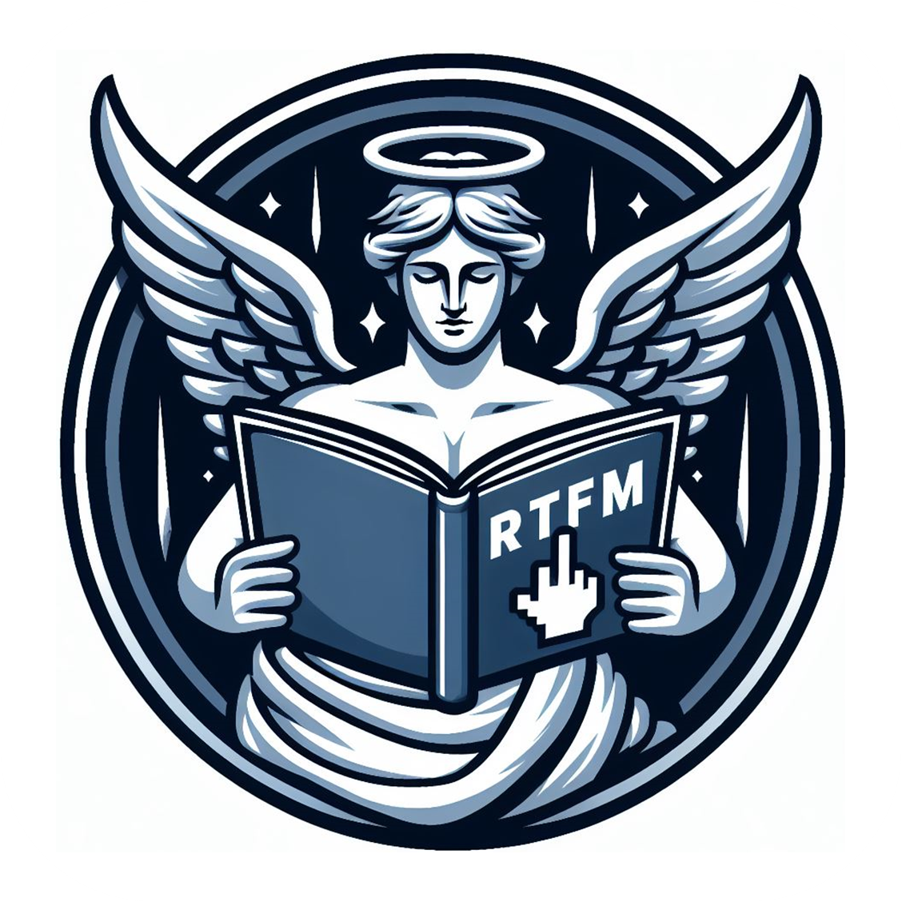

# Protocol _RTFM_

> [NOTE]
> If you've received this link, it means you need to read it. It's not a joke, meme, or prank—it's a serious protocol that requires your attention and understanding.

## TL;DR

**_RTFM_** ("**_Read The Fucking Manual_**") It's a colloquial expression used to encourage someone to consult the documentation or manual before seeking help or asking questions.

## What the Holy Mother of \<insert-someone-name\> is that protocol ?!

> **Mere-mortal**: _Is this a new network protocol ?_
>
> **Wise-guy**: _Nop._
>
> **Mere-mortal**: _Is this... an evacuation protocol ?_
>
> _**Wise-guy** becomes **Mad-guy**_
>
> **Mad-guy**: _Ask another stupid question and it'll become an evacuation protocol._

As a **developer** (but also for **_any_** job), understanding the _RTFM_ protocol is essential for effective collaboration and maintaining high-quality code (or high-quality work for other jobs or subjects). Let’s dive into what _RTFM_ means and how it impacts your development process:

### Definition

> _RTFM_ is an initialism and internet slang that stands for “Read The Fucking Manual.”

**_Usage_** : It’s typically used as a blunt response to basic questions where the answer is readily available in documentation, user guides, manuals, man pages, online help, forums, or FAQs.

**_Context_** : When someone asks a question without first consulting available resources, _RTFM_ serves as a reminder to check the documentation before seeking assistance from others.

**_Intent_** : _RTFM_ encourages self-reliance and promotes thorough research before reaching out for help.

### Why _RTFM_ Matters for Developers

**_Efficiency_** : By reading documentation first, you save time for both yourself and others.

**_Self-Sufficiency_** : Developers who _RTFM_ become more self-sufficient and confident in solving problems independently.

**_Respect_** : When you read existing documentation, you show appreciation for the effort put into creating it.

### Applying _RTFM_ in Your Workflow

#### Before Asking Questions

Always check official documentation, [README files](https://docs.github.com/en/repositories/managing-your-repositorys-settings-and-features/customizing-your-repository/about-readmes), and relevant resources.
Search forums, [Stack Overflow](https://stackoverflow.com/), and community discussions.
Explore code comments and inline documentation.

#### When Answering Questions

Encourage others to _RTFM_ politely.
Provide links to relevant documentation.
Share specific sections or examples from manuals.

**_In Commit Messages_** : Follow conventions (e.g., [conventional commits](https://www.conventionalcommits.org/en/v1.0.0/)) and write meaningful commit messages.
Avoid vague or unhelpful commit messages.
Be concise, descriptive, and respectful in your communication.

**_Remember_** : _RTFM_ doesn’t mean you should never ask questions; it means you should make an effort to find answers independently first.
Documentation is your ally—it’s there to help you succeed.
So, as a developer, embrace _RTFM_, explore documentation thoroughly, and contribute to a more informed and efficient coding community! :books::rocket:
